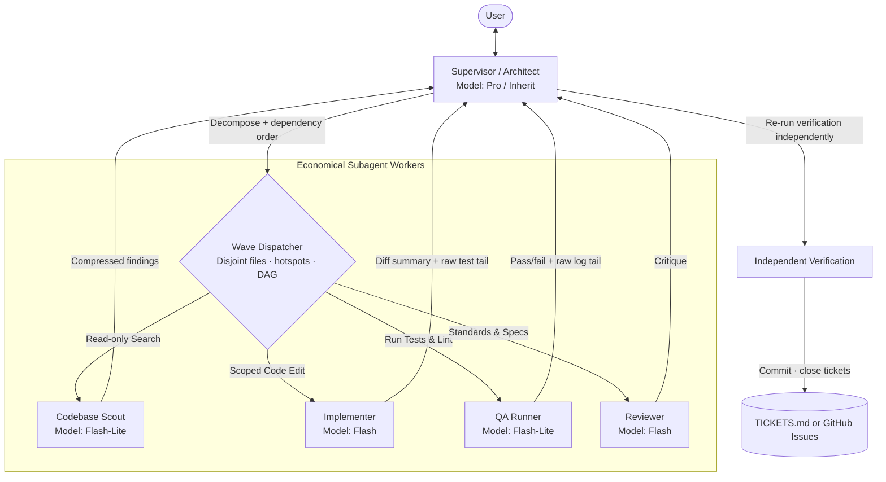

# Agent Orchestrator

[](https://opensource.org/licenses/MIT)
[](https://skills.sh/davekazemi/agent-orchestration)
[](#-installation)

[](#-runtime-compatibility)
[](#-runtime-compatibility)
[](#-runtime-compatibility)
[](#-runtime-compatibility)
[](#-runtime-compatibility)
[](#-runtime-compatibility)
[](#-runtime-compatibility)
[](#-runtime-compatibility)

A specialized skill and framework for **cost-optimized, hierarchical multi-agent orchestration**.

It equips any agent that reads `SKILL.md` / `AGENTS.md` (Claude Code, Cursor, Codex, Copilot, Windsurf, Gemini CLI, Antigravity, Cline, and others) to function as an **Architect / Supervisor** that manages context windows and delegates token-heavy exploration, coding, testing, and reviewing tasks to fast, economical subagent tiers (`flash` and `flash_lite`). The skill is a prompt document (`SKILL.md` plus templates), not a runtime: it changes how the agent behaves, using whatever subagent primitives the host actually exposes.

---

## 🚀 Why Agent Orchestrator?

In modern AI-assisted engineering, running a top-tier reasoning model (Pro / Opus-class) for every single sub-task has two fatal drawbacks:

1. **Massive Token Inefficiency**: Most tokens in a coding session go to repetitive codebase grepping, reading large files, running test commands, and formatting code, none of which needs frontier-level reasoning.
2. **Context Window Degradation**: As intermediate tool calls and test outputs accumulate, the model's context window dilutes, increasing latency and hallucination rates.

### The Solution: Hierarchical Tiering with Supervisor-Owned Verification

<p align="center">
  <a href="assets/architecture.html">
    
  </a>
</p>

<p align="center">
  <em>Generated with <a href="https://github.com/tt-a1i/archify">Archify</a>. Click the image or <a href="assets/architecture.html">open the interactive diagram</a> for animated trace flow, guided view chapters, and component inspection.</em>
</p>

<details>
<summary><b>View Mermaid / Text Flowchart</b></summary>



</details>

Workers never commit, push, call `gh`, or edit the ticket board. The Supervisor is the single writer for shared state and closes nothing on a worker's self-report alone.

---

## ✨ Features

- ⚙️ **Interactive Onboarding (`/orchestrate init`)**: Prompts the user to configure model tiers for the Supervisor and subagent roles, then persists the matrix into `AGENTS.md` and configuration files.
- 🔄 **Dynamic Reconfiguration (`/orchestrate update`)**: Easily change assigned models, roles, or concurrency settings at any time.
- 🧭 **Runtime Capability Detection**: Probes for subagent spawning, per-subagent model selection, and live messaging, then selects a mode (`full`, `tiered-sync`, `context-only`, `solo`) instead of assuming Antigravity tool names exist everywhere.
- ⚡ **Safe Parallel Dispatch**: Enforces the **Disjoint File Invariant** plus **dependency ordering** and **hotspot-file serialization**—units that share an interface or a manifest file never run in the same wave unverified.
- 📦 **Context Window Compression**: Subagents report only structured summaries, affected file lists, and the raw tail of their verification output. The Supervisor never gets bogged down with raw dumps.
- ✅ **Independent Verification**: A subagent's `SUCCESS` is treated as a claim. The Supervisor re-runs verification before committing or closing a ticket.
- 🔁 **Targeted Feedback Loops**: When a subagent encounters a test failure, the Supervisor sends corrective instructions via `send_message` (or respawns with the error embedded where live messaging is unavailable) rather than rewriting the code itself.
- 🎫 **Single-Writer Dual-Mode Ticketing**: Choose between **Local Markdown** (`.agents/TICKETS.md` for offline, zero-network self-containment) or **GitHub Issues** (via `gh` CLI). Subagents propose discoveries; only the Supervisor writes the board, commits, and closes tickets.

---

## 📁 Repository Structure

```
agent-orchestration/
├── SKILL.md                          # The core skill definition (Antigravity-first, portable)
├── README.md                         # Project documentation
├── LICENSE                           # MIT License
├── .gitignore                        # Git ignore rules
├── assets/
│   ├── architecture.svg              # Standalone showcase SVG diagram generated with Archify
│   ├── architecture.html             # Explorable interactive Archify viewer
│   └── architecture.workflow.json    # Archify diagram specification
├── templates/
│   ├── AGENTS.md.template            # Injectable orchestration rules for target repos
│   ├── orchestration.config.json     # Default role-to-model matrix, runtime mode, dispatch policy
│   └── TICKETS.md.template           # Scaffold template for local Markdown task board
└── references/
    ├── dispatch-guidelines.md        # Parallel safety, dependency ordering, verification, runtime fallbacks, economics
    └── ticketing-workflow.md         # Single-writer ticketing for GitHub Issues & local Markdown
```

---

## 📦 Installation

Install with the [skills CLI](https://skills.sh/docs/cli). It detects the agents on your machine and places the skill where each one looks for it, so the same command works for Claude Code, Cursor, Codex, Copilot, Windsurf, Gemini CLI, Antigravity, Cline, and the rest:

```bash
npx skills add davekazemi/agent-orchestration
```

No global install is needed; `npx` fetches the CLI on demand. The CLI is open source at [vercel-labs/skills](https://github.com/vercel-labs/skills) and collects anonymous install telemetry, which you can disable with `DISABLE_TELEMETRY=1`.

<details>
<summary>Manual install (no Node.js)</summary>

The skill is plain Markdown, so you can also clone it into whatever directory your runtime scans for skills, either globally (e.g. `~/.claude/skills/`, `~/.gemini/config/skills/`) or project-locally:

```bash
mkdir -p .agents/skills/
git clone https://github.com/davekazemi/agent-orchestration.git .agents/skills/agent-orchestrator
```
</details>

After installation run `/orchestrate init` once per project. It writes the orchestration block into that project's `AGENTS.md`, which most runtimes read even if they do not load `SKILL.md` directly. If you skip this step, the first `orch:` request will run init for you (see [First-run safeguard](#first-run-safeguard)).

---

## 🛠️ Usage

### Commands

| Command | Description |
| :--- | :--- |
| `orch: <task>` | Run one task with multi-agent orchestration |
| `/orchestrate on` / `off` | Enable or disable ambient orchestration for the workspace |
| `/orchestrate init` | Probe runtime capabilities, choose model tiers and ticketing mode, write config + `AGENTS.md` |
| `/orchestrate update` | Change role-to-model assignments, parallelism limits, or runtime capability overrides |
| `/orchestrate status` | Show active subagents, detected runtime mode, and a cost-weighted summary of the metrics ledger |
| `/orchestrate cancel` | Terminate in-flight subagents and return to manual control |

### 1. Initialize Orchestration in a Project
```text
/orchestrate init
```
The agent:
1. **Probes the runtime** for subagent spawning, per-subagent model selection, and live messaging, and records a mode (`full`, `tiered-sync`, `context-only`, or `solo`). If the mode is `solo`, it stops and tells you orchestration is unavailable here.
2. **Lists the models it can actually see**, presents them in a numbered menu, and suggests defaults matched to each role's capability profile:
   - **Supervisor** (High Reasoning & Planning): top-tier class (Pro / Opus)
   - **Codebase Scout** (High-throughput Read & Search): lightweight class (Flash-Lite / Haiku)
   - **Implementer** (Precise Code Synthesis): balanced class (Flash / Sonnet)
   - **Tester / QA** (CLI Exec & Log Parsing): lightweight class (Flash-Lite / Haiku)
   - **Reviewer** (Spec & Standards Critique): balanced class (Flash / Sonnet)
3. **Asks for a ticketing mode**: local Markdown (`.agents/TICKETS.md`, default) or GitHub Issues via `gh`.

Press `y` to accept the recommendations or enter custom numbers per role. The result is persisted to `.agents/orchestration.config.json` and injected into your project's `AGENTS.md`.

### 2. Update Configuration
```text
/orchestrate update
```
Switch any role's model (e.g. promote the Implementer to `pro` for a hard refactor), change parallelism limits, or override the detected runtime capabilities.

### 3. How Orchestration Runs (Opt-In by Default)

By default, the primary model works **solo / directly** on tasks to avoid unnecessary dispatch latency.

#### Option A: Per-Task Trigger (`orch:`)
Prepend `orch:` to a complex task:
> `orch: add token expiry validation in auth.py and update the unit test suite`

#### Option B: Workspace Continuous Toggle
```text
/orchestrate on    # orchestrate every task that passes the complexity threshold
/orchestrate off   # back to requiring the orch: prefix
```

#### First-run safeguard
`orch:` and `/orchestrate on` never dispatch subagents into an unconfigured workspace. If `.agents/orchestration.config.json` is missing and `AGENTS.md` has no `agent-orchestration` block, the agent stops, tells you the project is not initialized, runs the `/orchestrate init` flow (capability probe, model menu, ticketing choice), and only then continues with your original task. Decline the init prompt and the task runs solo instead. This prevents a cold `orch:` from guessing model tiers or dispatching in a runtime that cannot spawn subagents.

#### Complexity Threshold
Even when triggered, orchestration engages only if the task spans **3+ files across 2+ modules**, needs **~10+ file reads** before a plan can be formed, or has **2+ genuinely independent units**. Smaller tasks run solo because dispatch overhead would exceed the savings. In `context-only` mode the thresholds double.

#### Mandatory Transparency Banner
Whenever orchestration engages, the agent displays a notice at the very top of its initial response, including the detected runtime mode:

```markdown
> [!NOTE]
> 🚀 **Orchestration Active** (mode: `full`): Delegating sub-tasks across tiered subagents (Implementer: `flash`, Tester: `flash_lite`, Scout: `flash_lite`).
```

In `context-only` mode the banner also states that no cost savings are expected.

#### What Happens During an Orchestrated Task
1. **Decompose** the objective into units, each with a role, a bounded file scope, and a deliverable.
2. **Check conflicts and dependencies**: disjoint files, shared hotspot files (manifests, lockfiles, barrel files, `TICKETS.md`) serialized or reserved for the Supervisor, and a dependency order so a unit never builds against an interface another unit is still changing.
3. **Checkpoint** the working tree, then dispatch a wave of workers within the concurrency limit, pasting relevant Scout findings into each prompt.
4. **Collect** structured results: status, files touched, terse diff summary, the raw tail of the verification output, and any proposed discoveries.
5. **Re-verify independently**: the Supervisor re-runs the test/lint command itself before trusting any worker's `SUCCESS`.
6. **Commit and close**: the Supervisor commits, records discoveries, and closes tickets. On a partial wave failure it either commits a coherent subset or reverts to the checkpoint.
7. **Feedback loop**: failures go back to the worker with the exact error (live message where supported, respawn-with-context otherwise). Two strikes on the same step escalate to you.

---

## 🧩 Runtime Compatibility

The dispatch mechanics are written against Antigravity primitives (`invoke_subagent`, `send_message`, `manage_subagents`). Other runtimes usually lack live messaging and sometimes lack per-subagent model selection. The skill probes for these at init, records the result in `orchestration.config.json`, and degrades explicitly:

| Mode | What the runtime offers | Effect |
| :--- | :--- | :--- |
| `full` | spawn + per-role models + live messaging | Everything works as documented |
| `tiered-sync` | spawn + per-role models | Feedback via respawn-with-context, one retry |
| `context-only` | spawn only | Context isolation only; no cost savings, large tasks only |
| `solo` | no spawn primitive | Orchestration disabled with a notice |

If the probe gets it wrong, override individual capabilities with `/orchestrate update` (option 7).

---

## 📊 Economics & Token Savings

| Role | Standard Single-Agent | Agent-Orchestrator Tier | Per-Token Cost Ratio (indicative) |
| :--- | :--- | :--- | :--- |
| **Exploration / Grep** | `pro` | `flash_lite` | **~0.05x - 0.10x** |
| **Implementation** | `pro` | `flash` | **~0.15x - 0.25x** |
| **Unit Testing / Lint**| `pro` | `flash_lite` | **~0.05x - 0.15x** |
| **Supervisor Oversight**| `pro` | `pro` | Clean context, minimal tokens |

These are per-token list-price ratios, not end-to-end savings. Each worker starts cold and re-reads context, cheaper models retry more often, and decomposition, dependency analysis, and independent verification all run on the Supervisor. Savings are real on large, genuinely parallel tasks and can be zero or negative on small or tightly coupled ones, which is why orchestration is opt-in and gated by a complexity threshold.

### Verifying the savings yourself

The ratios above are a hypothesis, not a measurement. The skill gives you two ways to check them against your own workload.

**1. Per-task ledger (`.agents/orchestration-metrics.jsonl`)**
After every orchestrated task the Supervisor appends one JSON line: task summary, runtime mode, wall time, per-role token counts (input/output per model), retries, whether independent verification passed, and a `source` field that says whether the counts came from the runtime's usage API or were estimated (`chars/4`) because the runtime exposes none. `/orchestrate status` summarizes this ledger: total tokens by model, share of work on economical tiers, cost-weighted total, retry rate. Enable `metrics.recordSoloBaseline` in the config to log ordinary solo tasks too, so the two populations sit side by side.

**2. A/B against the billing dashboard (ground truth)**
Self-reported counts can be wrong, so the number that matters is what your provider bills. The protocol:

1. Pick a task that clears the complexity threshold and can be re-run from the same commit (a branch off `main`, tests included).
2. Note the provider usage/billing figure, run the task solo (no `orch:`), note the figure again, and record the delta plus wall time and whether tests pass.
3. Reset the branch to the same commit, repeat with `orch:`.
4. Compare **cost**, not raw tokens. Orchestration usually uses *more* total tokens (cold starts, retries) and fewer *expensive* tokens; the savings only show up once each model's tokens are weighted by its price. Put your prices in `metrics.pricing` so `/orchestrate status` weights them the same way.
5. Repeat on two or three tasks of different shapes. One sample says nothing; a tightly coupled task will likely show a loss and a wide, parallel one a gain. That is the expected result and the reason the complexity threshold exists.

If the ledger and the dashboard disagree by more than roughly 20%, trust the dashboard and treat the runtime's usage reporting as unreliable for that mode.

---

## 🤝 Contributing

Contributions, issues, and feature requests are welcome! Feel free to check the [issues page](https://github.com/davekazemi/agent-orchestration/issues).

---

## 📄 License

Distributed under the [MIT License](LICENSE). Copyright © 2026 [Davood Kazemi](https://github.com/davekazemi).
